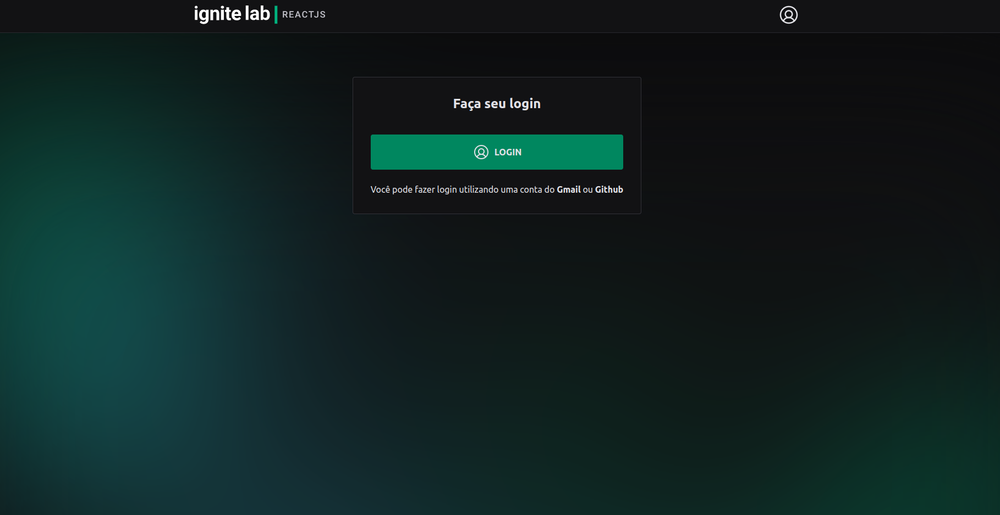

<div align="center" style="margin-bottom: 20px;">
  <h1>STUDY PLATFORM</h1>
  <p align="center">
    
    
    
    
    
  </p> 

  
</div>

### About project
An event platform for studies, this project was developed at the Rocketseat school's ignite lab event, it was used as main technologies: ReactJS, Tailwindcss, GraphQL and the Headless CMS called GraphCMS.


### Main technologies
- [Vite](https://vitejs.dev/)
- [TypeScript](https://www.typescriptlang.org/docs/)
- [ReactJS](https://pt-br.reactjs.org/)
- [TailwindCSS](https://tailwindcss.com/)
- [GraphQL](https://graphql.org/)
- [Apollo](https://www.apollographql.com/docs/react/)
- [Graphql-code-generator](https://www.graphql-code-generator.com/)
- [GraphCMS](https://graphcms.com/)
- [Auth0](https://auth0.com/pt)

### Run this project
```bash
# clone this project
$ git clone https://github.com/jefferson1104/study-platform-reactjs.git

# access the project folder
$ cd study-platform

# install dependencies
$ npm install

# run the project on the local machine
$ npm run dev
```

### Screenshots
<p align="center">
  
  
  
</p>
